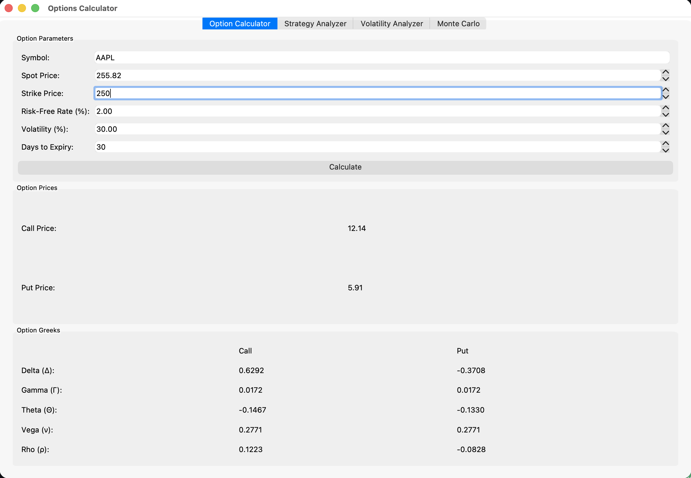
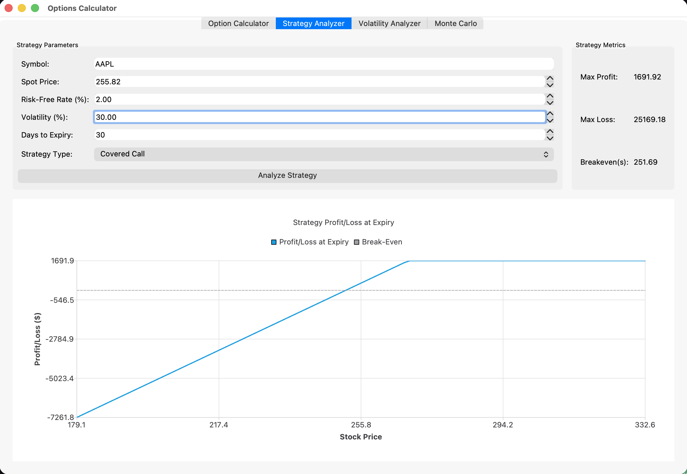
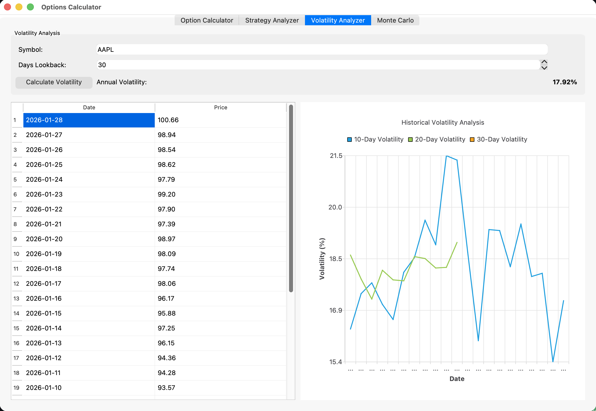
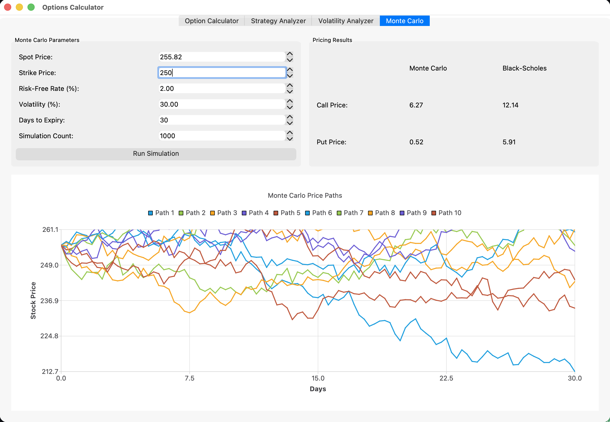

# Black-Scholes Options Pricing and Paper Trading System

A C++17 application for option pricing, strategy analysis, volatility estimation, and Monte Carlo simulation. It includes a **CLI** for paper trading with live market data and a **Qt GUI** (Options Calculator) for interactive analytics.

---

## Options Calculator GUI

The **Options Calculator** (`options_calculator_gui`) is a desktop app with four main tabs. Below is what each one does, with screenshots.

### 1. Option Calculator

Compute Black–Scholes option prices and Greeks from your inputs.

- **Inputs:** Symbol (e.g. AAPL), Spot Price, Strike Price, Risk-Free Rate (%), Volatility (%), Days to Expiry  
- **Outputs:** Call Price, Put Price  
- **Greeks** for both Call and Put: **Delta (Δ), Gamma (Γ), Theta (Θ), Vega (ν), Rho (ρ)**  
- **Calculate** runs the pricing and updates all results.



---

### 2. Strategy Analyzer

Analyze multi-leg option strategies and see P/L at expiry.

- **Inputs:** Symbol, Spot Price, Risk-Free Rate (%), Volatility (%), Days to Expiry, **Strategy Type** (e.g. Covered Call, Protective Put, Bull Call Spread, Bear Put Spread, Straddle)  
- **Analyze Strategy** computes metrics and refreshes the chart.  
- **Strategy metrics:** Max Profit, Max Loss, Breakeven(s)  
- **Chart:** Profit/Loss at expiry vs. stock price, with a break-even (zero P/L) line.



---

### 3. Volatility Analyzer

Estimate historical volatility and inspect rolling windows.

- **Inputs:** Symbol, **Days Lookback**  
- **Calculate Volatility** produces **Annual Volatility** (e.g. 17.92%)  
- **Table:** Date and Price for the lookback period  
- **Chart:** 10-, 20-, and 30-day rolling historical volatility over time



---

### 4. Monte Carlo

Price options by simulation and compare to Black–Scholes.

- **Inputs:** Spot Price, Strike Price, Risk-Free Rate (%), Volatility (%), Days to Expiry, **Simulation Count**  
- **Run Simulation** runs the Monte Carlo pricer and updates results + chart.  
- **Pricing results:** Call and Put prices from **Monte Carlo** and from **Black–Scholes** side by side  
- **Chart:** Sample Monte Carlo price paths (e.g. 10 paths) from spot to expiry



---

## Project Overview

- **Option pricing:** Black–Scholes for European calls/puts (with edge-case handling for T→0 and σ→0).  
- **Market data:** Optional Alpha Vantage integration for current and historical prices (CLI).  
- **Paper trading:** Simulated option positions, cash balance, and portfolio value (CLI).

## Build

- **Requirements:** CMake 3.14+, C++17, CURL. Optional: Qt5 (Core, Widgets, Charts) for the GUI; nlohmann/json is fetched by CMake if not installed.  
- From the project root:

  ```bash
  mkdir build && cd build
  cmake ..
  cmake --build .
  ```

- If Qt5 is not found, only the CLI target `option_trading` is built.

## Run

- **CLI (paper trading + live data):**  
  `./option_trading`  
  Uses `ALPHA_VANTAGE_API_KEY` from a `.env` file in the project or next to the executable.

- **GUI (Options Calculator):**  
  `./options_calculator_gui`

## Dependencies

- C++17 compiler  
- CMake 3.14+  
- CURL  
- nlohmann/json (via FetchContent if needed)  
- Qt5 (Core, Widgets, Charts) — only for the GUI  

## License

See repository for license information.
